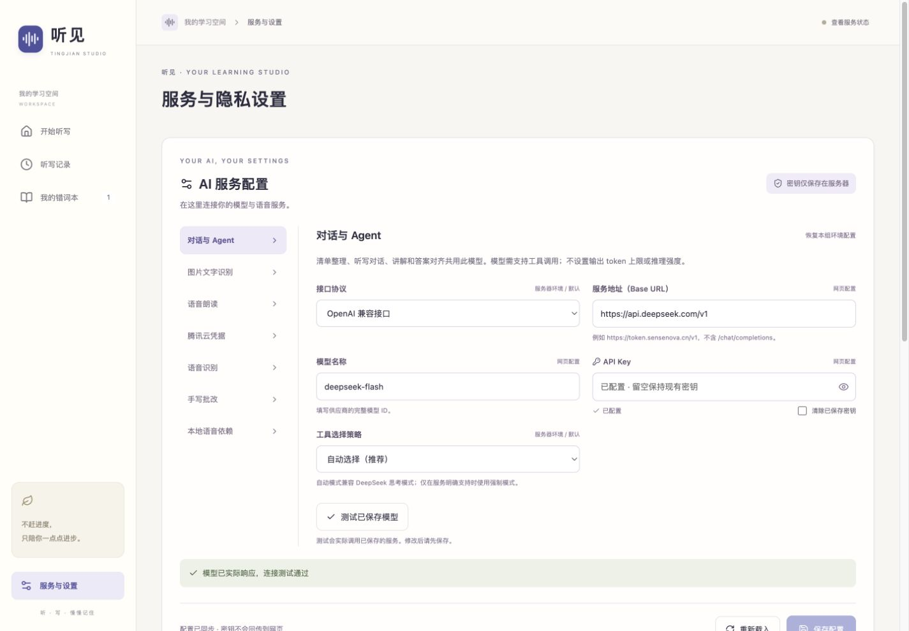

# 网页 AI 配置验证

日期：2026-10-03（Asia/Shanghai）。

## 完成范围

28 个实际使用的 AI 配置项分为 7 组，接入服务与设置页面。包括服务地址、模型、密钥、默认服务、腾讯地区与引擎、本地语音接口及执行程序路径。未重新引入输出 token 限制或推理强度覆盖。原示例中的模型家族和大小字段并未被服务使用，统一以实际模型 ID 配置规格。

服务器私有覆盖文件为 `.local/ai-settings.json`。所有服务通过同一配置读取层取值，每个请求固定配置快照。使用原子替换、文件锁和版本冲突检测保存；密钥只返回布尔配置状态。音频缓存纳入配置指纹，客户端读取版本后使用对应缓存，避免换模型仍播放旧音频。

## 自动验证

- `npm test`：78 项通过。
- 类型检查、生产构建、修改文件格式检查通过。
- 覆盖密钥不回显、继承环境变量、保存与恢复、显式清除密钥、文件 600 权限、非法地址及执行路径、配置白名单、并发写入冲突、旧版本拒绝、目标服务域名改变时密钥授权、请求快照隔离。
- 配置 API 鉴权及跨站写入拒绝通过。
- 音频相同输入在配置版本改变后重新生成，原版本不继续命中。
- 模型请求仍不发送输出 token 上限或推理强度。支持配置自动/强制工具选择，工具循环保留供应商要求的内部续传字段，用户答复不包含该字段。

## 浏览器与真实服务

- 使用独立 `localhost:3002` 配置文件，验证地域保存、刷新后持久化、恢复环境值、替换测试密钥后清空输入框、清除密钥及恢复。
- 输入框读取既有密钥时为空，仅显示“已配置”；服务返回中没有当前或继承密钥明文。
- 手机 390 像素宽度检查配置字段与保存按钮，无横向页面溢出。
- 另一个页面实际更新了 DeepSeek 的地址、模型和密钥。旧页面的保存被版本检查拒绝，这份更新被保留。
- 实测 DeepSeek 思考模式拒绝 `tool_choice: required`（HTTP 400）。改用默认 `auto` 后，同一已保存服务成功选择 `pause` 工具（HTTP 200），保持默认思考设置。
- 正式页面“测试已保存模型”已实际调用当前 DeepSeek 配置，显示连接测试通过；浏览器未发现控制台错误。

## 生效边界

新配置从后续请求生效；已开始的请求及进行中的听写保留对应快照。更改本地模型 ID 不负责启动或下载外部模型。API 令牌和外部模型的服务权限、供应商额度、网络可用性仍由对应服务决定。

用户在测试期间录入的新模型配置已迁移至正式私有配置目录。`localhost:3000` 与 `localhost:3001` 读取同一份配置，版本一致，配置文件权限为 600；密钥明文不写入本文或截图。检查结果见 [production.json](production.json)。

[手机配置页面](mobile.png)
