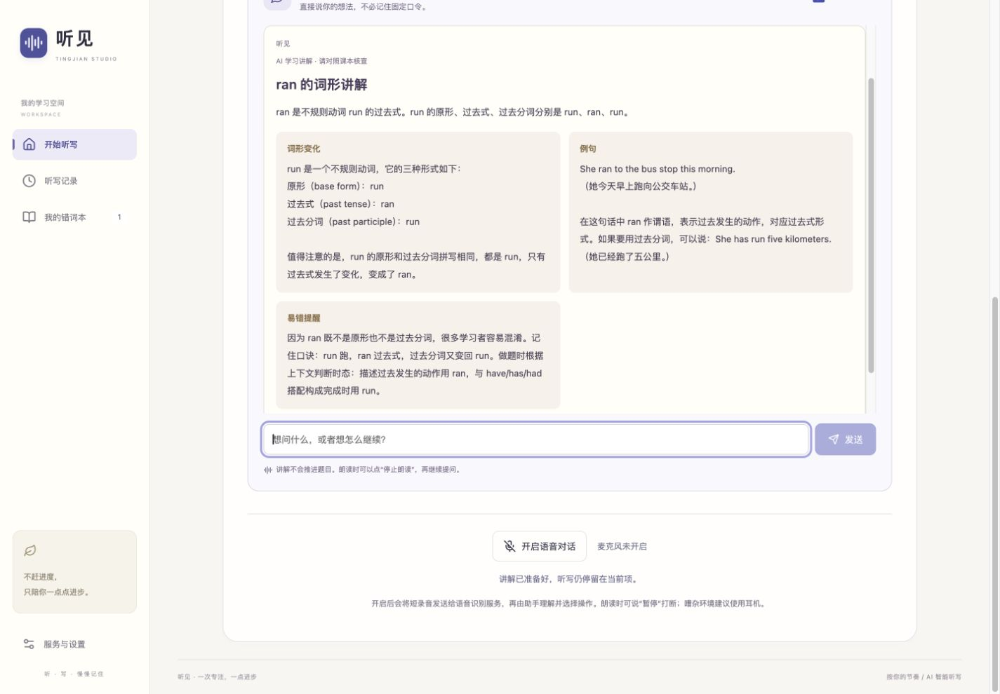

# 前端与听写对话验证

日期：2026-10-03（Asia/Shanghai）。

## 界面

从新的随机英数字串提取重复与长短节奏，采用奶油白、鸢尾蓝、杏黄、宋体标题和原生书页插画。随机串未写入界面或静态资源。首页独立为 `StudyHome`，显示真实草稿、练习和错词数据；编辑、设置、听写、批改及导航使用同一配色。

在 1440、768、390、320 像素宽度检查首页；窄屏按钮改为纵向排列。手机清单编辑、设置、图片编辑、听写与批改均检查过，无横向页面溢出。手机检查是视口测试，不是真机硬件测试。

## 模型输出

- 移除通用模型请求的 4096 tokens 限制，以及整理 Agent 的 256 / 800 / 2500 tokens 限制。
- 不发送 `max_tokens`、`max_completion_tokens`、`max_output_tokens` 或 `reasoning_effort`。不读取供应商的内部推理作为用户答复。
- 本地配置中旧的推理覆盖已移除；服务端实际返回不完整结果时仍拒绝应用。
- 解释使用 `present_explanation` 工具返回标题、正文与分段，兼容供应商直接返回的普通最终正文。控制工具始终严格验证，未选择工具、多工具、无效参数均不能执行。

## 听写对话

`/api/session-agent` 独立于清单整理 Agent。支持 `control_dictation`、`explain_current_item`、`respond_to_student`，使用当前题目状态和最近对话理解自然表达。操作模型不接收当前答案；只有解释工具读取答案。提示关闭时隐藏讲解工具和历史。

一次只执行一个操作。下一项仅在等待状态允许；结束只打开确认框。请求版本、会话 ID、题号和播放轮次共同拦截迟到结果，按钮操作和取消会中止请求。讲解标记提示使用，不推进题目。

讲解卡片分段排版，清理 Markdown 标记，支持自动朗读、停止和重听。完整正文按句分成不超过 850 字符的 TTS 请求，避免超过单次接口限制；不会截断模型正文。音频与当前词朗读互斥，停止、换题、退出时取消等待、停止播放并释放 URL。

## 验证结果

- `npm test`：69 / 69 通过。
- `npm run typecheck`、生产构建及修改文件格式检查通过。
- 新增模型请求测试检查实际发送的参数、提取与生成模式、多轮工具调用、未完成响应、工具白名单、提示关闭、讲解结构和正文兼容。
- 新增测试覆盖 Unicode 长文本完整分段、逐段播放、生成阶段取消、播放阶段停止、URL 释放、旧轮次拒绝和 Markdown 显示。
- 浏览器中用两项测试内容完成录入、真实 Edge 朗读、下一项、暂停、刷新恢复、结束核对和加入错词本；图片上传使用仓库测试图片。
- 自然表达“刚刚那个我没跟上，能慢些再说一遍吗？”实际选择慢速重读，语速由 1.0× 变为 0.9×，题号不变。
- 实际讲解返回 `run—ran—run` 及例句，分段显示、语音重听、停止和恢复当前词均已检查。
- 对话讲解在 390 像素宽度无横向溢出；浏览器中取消请求后立即恢复可用，仍停留在原题并保持暂停。
- 合成语音“我想去拿支笔，先等我一下。”通过真实腾讯 ASR 返回同样文本，实际 Agent 选择 `pause`；记录见 [conversation-live.json](conversation-live.json)。这是合成音频集成测试，不是真人麦克风测试。
- 真实多轮讲解接口返回见 [explanation-live.json](explanation-live.json)。

## 已知边界

模型曾返回过不完整结构和错误的词形解释。已改用讲解工具、加强词形核对、保留普通正文兼容，但不保证 AI 知识始终准确，卡片明确提示核查。供应商限流或失败仍会明确显示，按钮和当前进度保留。

最后一次自然表达“这一题已经写完啦，可以往下继续了”的实测遇到供应商 429，未执行推进；不能将该次调用算作成功验证。下一项的状态门控由自动测试覆盖，慢速重读和语音暂停已完成真实服务验证。

真人麦克风、扬声器回声、手机摄像头与后台行为仍需要实机验证。朗读期间仅处理明确的暂停意图，避免把自己的声音送入对话操作；可以用按钮停止讲解后继续自然提问。

测试数据位于 `localhost:3001`，没有替换 `localhost:3000` 的学习记录。现有听写数据结构保持兼容。

生产服务已重启于 `http://localhost:3000`，首页与全部引用的脚本、样式均返回 200，新对话接口的非法输入返回 400；见 [production.json](production.json)。

[手机讲解](conversation-mobile.png) · [手机首页](mobile.png) · [平板首页](tablet.png)
