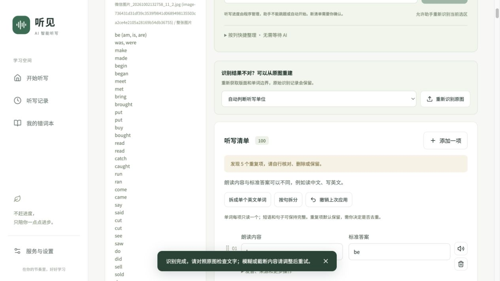

# 重新上传重复记录修复

2026-10-03（Asia/Shanghai）

## 原因

浏览器自动恢复了 IndexedDB 中的草稿。首页上传随后将图片追加到旧列表，每次上传又生成不同的随机 ID，使同一文件的来源字符串不相等。识别条目仅按完整来源字符串替换，原始记录则不断追加，导致关闭后重新上传时累加。

## 修改

- 首页新上传和直接输入开启空清单；“继续编辑清单”恢复草稿。打开文件选择器后取消或上传无效文件，不清空草稿。
- HTTPS / localhost 下使用文件内容的 SHA-256 生成图片 ID。相同内容改名后仍为同一图片；同名不同内容不会合并。图片处理页重复添加保留已有选区，旧版图片也可按相同图片数据匹配。
- 一次识别完成全部选区后统一提交，替换对应图片的条目和原始记录。取消或失败不会应用半份新结果，修改图片/选区后旧请求结果不会入库。
- 来源替换不对单词去重，因此原图中真正重复的词仍会保留。保存撤销快照，历史和错词本不参与新清单重置。
- 文件选择器用后重置，确保连续选择同一个文件仍触发上传。

## 验证

- 56 项测试、TypeScript 检查、生产构建及格式检查通过。新增覆盖同图改名、同名不同图、重复添加保留选区、序列化后重新识别、选区与整图互相替换、原文记录合并和重复词保留。
- 使用独立的 `127.0.0.1:3001` 浏览器存储测试，未操作用户原有 `localhost:3000` 数据。
- 用户原图首次真实 OCR：100 项。
- 关闭标签页并重新打开：“继续编辑清单（100 项）”可恢复旧草稿。
- 从首页重新上传同一张图片：识别前为 0 项；识别后为 100 项、1 份原始记录。
- 图片处理页再次添加同图：仍为 1 张图片。再次识别后：仍为 100 项、1 份原始记录。
- 页面提示的 5 个重复词来自原始词表中相同的原形/过去式，不是重复导入的一整份词表。
- 已重新启动 `localhost:3000` 生产服务，首页返回 HTTP 200。

