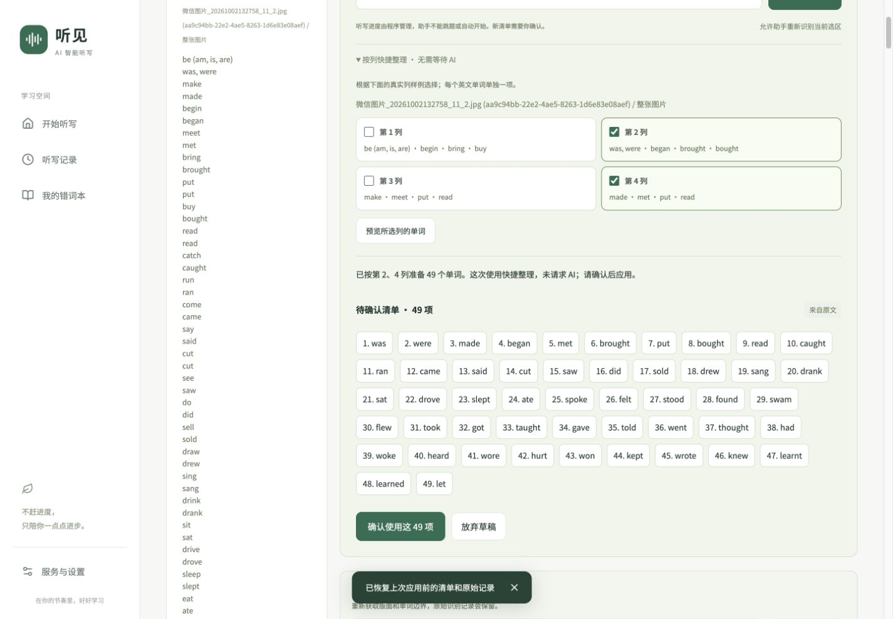

# 混合架构交付验证

验证日期：2026-10-02 至 2026-10-03（Asia/Shanghai）。继续完成上一轮中断的 Agent 与词表改造，保留现有服务配置和本地学习数据。

## 已完成

- 默认腾讯高精度 OCR 保留文字框和行列；英文词表逐词生成听写项，原始文本、重复词及来源保留。
- 程序提供真实材料概览，SenseNova 用 function calling 选择提取方式。按列、按语言、按当前清单筛选，以及逐字核查原文片段和提示/答案配对均已实现。
- 生成练习需要选择对应模式，生成标记在后续拆分时仍保留。新提案需要确认，应用前保存撤销快照；Agent 无法执行播放或推进听写。
- 取消、离开页面以及识别期间修改清单时，旧结果不能覆盖当前编辑。快捷列选择在 Agent 请求期间禁用，避免异步结果替换预览。
- 当前清单筛选不会恢复已经删除的源词；不允许把当前清单范围与原图列号混用。英文拆分保留无法拆分的纯中文项。
- 损坏的版面材料返回 400；乱码、低置信度及疑似整行串读要求核查；提取工具拒绝伪造来源和原文中不存在的答案。

## 自动验证

| 检查                    | 结果                        |
| ----------------------- | --------------------------- |
| `npm test`              | 51 / 51 通过                |
| `npm run typecheck`     | 通过                        |
| `npm run build`         | Next.js 16.3.8 生产构建通过 |
| 修改文件 Prettier 检查  | 通过                        |
| 不完整版面材料 API 请求 | HTTP 400，未请求模型        |

核心测试覆盖原图四列、25 行、100 个独立词，原形 51 项、过去式 49 项，以及短语保留、重复项、原文片段校验、生成标记、旧口令拦截、最后一项确认、裁剪坐标和批改核查规则。

## 真实服务调用

用户词表：`微信图片_20261002132758_11_2.jpg`，印刷体，不是手写照片。

| 调用                | 实测结果                                                      | 记录                                     |
| ------------------- | ------------------------------------------------------------- | ---------------------------------------- |
| 腾讯 OCR            | 100 项，最新一次 1.403 秒                                     | [latest/ocr.json](latest/ocr.json)       |
| SenseNova Agent     | 实际调用 `prepare_dictation`，49 项过去式，最新一次 18.300 秒 | [latest/agent.json](latest/agent.json)   |
| 较早一次 Agent 成功 | 同样返回 49 项，1.845 秒                                      | [agent-current.json](agent-current.json) |
| Edge 单词朗读       | `was`、`were` 分别生成 WAV，1.584 / 2.248 秒                  | [audio-current.json](audio-current.json) |
| 腾讯 ASR            | 合成的“好了”“还没好”“听不清”分别正确转写，0.103–0.320 秒      | [audio-current.json](audio-current.json) |

集成脚本对照人工核对的 47 组原形/过去式词对，验证完整的 49 个过去式词形，而非只检查数量。脚本遇到限流、错误响应或结果不匹配时以非零状态退出。

本轮仍观察到 SenseNova 429，说明调用耗时和可用性取决于供应商，不能把单次成功当作稳定延迟保证。页面显示真实失败，并保留清单；按列快捷整理可继续使用，明确标注没有请求 AI。

## 浏览器验证

在 `127.0.0.1:3000` 的独立浏览器存储中测试，没有覆盖 `localhost:3000` 已有学习记录。

1. 上传原图，使用默认自动模式，真实识别后清单为 100 项，前六项为 `be / am / is / are / was / were`。
2. 网页 Agent 限流后，当前清单仍为 100 项。选择第 2、4 列后显示 49 项预览；确认前不修改清单。
3. 修改第一项后旧提案确认按钮禁用。重新生成并确认后为 49 项；撤销恢复 100 项。
4. 再次应用 49 项，使用 Edge 真实音频开始听写。重读后立即暂停仍在第 1 项；继续并点击一次“写好了”后进入第 2 项 `were`，播放结束继续等待。
5. 刷新并恢复，保持第 2 / 49 项、已暂停、麦克风关闭。取消助手任务后立即恢复可操作状态，现有 49 项不变。
6. 检查 1440×1000 桌面及 390×844 手机视口，清单预览、列选项和按钮可用，无横向页面溢出。

[手机清单预览](columns-mobile.jpg) · [刷新后暂停状态](restored-mobile.jpg)

## 运行与边界

应用以生产模式运行在 `http://localhost:3000`。生产首页、健康接口及 Edge 生成检查见 [production-current.json](production-current.json)。启动日志位于 `/tmp/quiet-dictation-3000.log`；手动重启使用 `npm start`。

- 真人麦克风、真实手写照片批改、手机真机摄像头及扬声器回声仍需实机验证。视口检查不是手机硬件测试；合成音频不是用户真人语音测试。
- 当前默认使用 Edge 联网朗读；本地 MLX 配置仍保留，本轮没有重启或重新验证 8765 服务。
- 原文片段和生成工具的规则已通过单元测试；本轮实时模型成功场景为过去式按列提取，没有声称任意自然语言要求都能正确完成。
- 所有模型密钥继续留在服务器配置中。服务“最近调用成功”是进程内记录，重启后会回到已配置、待验证状态。
