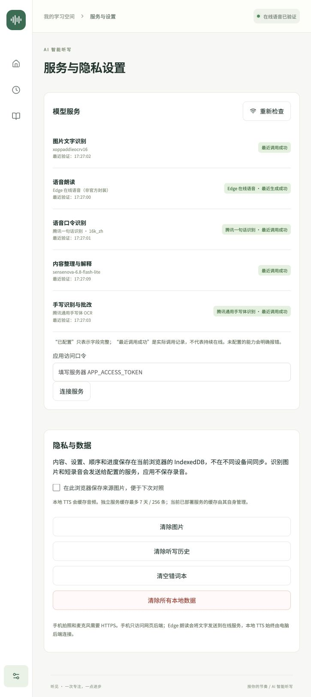

# 腾讯云、SenseNova、Edge 接入验证

日期：2026-10-02。用户提供了腾讯云 CSV 凭据和 SenseNova 接口配置。本轮已将它们写入仅服务器读取的 `.env.local`（权限 600），没有将密钥写入此文档或客户端。

## 实际启用

| 功能               | 后端                                              | 本轮结果                                                                         |
| ------------------ | ------------------------------------------------- | -------------------------------------------------------------------------------- |
| 课本图片 OCR       | 原有讯飞 xoppaddleocrv16                          | 生产 HTTP 200，约 1.484 秒                                                       |
| 朗读               | Edge 在线语音；保留可选 MLX                       | 生产生成“好了”约 1.380 秒，56,654 字节 WAV                                       |
| 语音口令           | 腾讯 SentenceRecognition，16k_zh                  | 同一合成音频识别为“好了。”，生产请求约 0.239 秒                                  |
| 整理、解释、意图   | SenseNova sensenova-6.8-flash-lite                | JSON、解释、冲突意图和按要求拆分词对均获得真实返回                               |
| 手写识别及答案对齐 | 腾讯 GeneralHandwritingOCR + SenseNova 行 ID 对齐 | 生产整条链路 HTTP 200，约 6.996 秒；本次图像为印刷词表，仅证明接口与对齐链路连通 |

`localhost:3000` 的生产服务已更新，界面可显式选择 Edge 在线语音或本地 Qwen3-TTS。Edge 是非官方封装，设置页显示联网传输说明，不会在失败时偷偷回退到其他供应商。本地服务需用户自行启动，旧的 8765 配置仍保留。

## 官方接口依据

- [SenseNova 官方文档](https://platform.sensenova.cn/docs)：官方页面的文档内容明确给出 `https://token.sensenova.cn/v1/chat/completions`、`Authorization: Bearer ...`、`sensenova-6.8-flash-lite`、JSON 输出及 `reasoning_effort=none` 示例。本轮使用一次真实 JSON 请求确认返回有效对象。
- [腾讯官方 Node.js SDK](https://github.com/TencentCloud/tencentcloud-sdk-nodejs)：安装 `tencentcloud-sdk-nodejs-asr` / `tencentcloud-sdk-nodejs-ocr`；使用 SDK 的 TC3 签名，不手工改造密钥。
- SDK ASR `v20190614` 的 `SentenceRecognitionRequest` 声明 `EngSerViceType=16k_zh`、`SourceType=1`、支持 PCM、`DataLen` 是 Base64 编码前字节数。浏览器 WebM/MP4/OGG/WAV 经 FFmpeg 转 16 kHz 单声道 PCM。
- SDK OCR `v20181119` 的 `GeneralHandwritingOCRRequest` 支持 `ImageBase64`；响应 `TextDetections` 提供 `DetectedText`、0–100 的真实 `Confidence`、`Polygon`。WebP 会在后端转换为 JPEG。
- SDK `AbstractClient.request(action, req, {signal})` 是公开接口，用于把取消请求传递到实际 HTTP 调用。
- [edge-tts 项目](https://github.com/rany2/edge-tts)：通过独立 Python 脚本读取 stdin、生成音频到 stdout，不保存录音、不输出用户文本及密钥。

## 真实语音与语言模型测试

开发服务先后生成并交给腾讯识别：

| 原始合成口令 |            Edge 完整生成时间 | 腾讯识别请求时间 | 最终转写 |
| ------------ | ---------------------------: | ---------------: | -------- |
| 好了         | 3.249 秒（包含首次编译准备） |         0.382 秒 | 好了。   |
| 还没好       |                     1.183 秒 |         0.179 秒 | 还没好。 |
| 听不清       |                     1.142 秒 |         0.141 秒 | 听不清。 |

这些是**合成音频 → 真 ASR**的链路测试，不是用户真人说话，也没有验证物理扬声器回声或手机麦克风。返回的句末标点经过规则解析后分别得到 next、pause、repeat，仍受现有状态机的轮次/等待阶段约束。

SenseNova 实测：

- JSON 健康样例返回 `{"ok":true}`。
- “我已经写好了，不过等一下，先别往后读。”返回结构化 `pause`。
- `began` 解释正常返回中文释义与例句。
- 整理中曾出现一次 HTTP 429；首次成功响应也曾未按要求提取词对。已强化系统提示，明确区分“禁止新增内容”和“允许提取拆分”，保留服务端原文核查。
- 最终真实整理返回 `spoken=begin, answer=began`、`spoken=bring, answer=brought`，原文与来源未覆盖。耗时约 15.636 秒，不能宣称该语言模型总是低延迟。
- HTTP 重试尊重有界的 Retry-After，并响应用户取消；失败时保留旧清单，AI 提案仍需用户确认。

## 识别与批改的可靠性

使用用户此前指定的印刷词表图片，腾讯识别返回 94 个文字块。SenseNova 只允许输出索引匹配；后端从对应的腾讯原文构造 recognized，绝不采用语言模型自行编写的答案。

- 低于 80 的腾讯真实置信度触发人工核查；80 是应用阈值，不是供应商的“正确率”。
- 同一 OCR 行被多题复用、行 ID 不存在、重复 ID、缺少唯一对应关系，都不能成为自动判错依据。
- 对齐服务失败时，原始 OCR 文本依然返回并保留，所有未对齐项目进入待确认。
- 原始识别文字及置信度可以在完成页展开查看，文本随批改记录保存在当前浏览器；原始图片仍按用户保存选项处理。
- 此图是印刷体，真实手写准确率尚未验证；需要真实手写照片才能评估。

## 自动验证及部署

- 34 / 34 单元测试通过：原有状态机/图像裁剪 28 项，新增声音解析、旧会话迁移、原始错误拼写保留、无效/重复行对齐、低置信度复核、真实腾讯转写标点 6 项。
- `npm run typecheck`、额外 unused 检查、生产 `npm run build` 通过。
- Python 脚本语法检查通过。
- SDK 上游引用的 uuid 9 审计问题通过仅针对该依赖的 uuid 11.1.1+ override 修复；SDK 仅使用兼容的 `v4()`，修复后生产 ASR/OCR 再次实际调用成功。当前依赖审计 0 项漏洞。
- 构建器曾错误追踪 Python 虚拟环境的系统解释器软链接；改用运行时 `EDGE_TTS_PYTHON` 配置后生产构建通过，未将系统 Python 打包到网页。
- 扫描 `.next/static` 与 docs 中的实际密钥，匹配数为 0。
- 页面显示的“最近调用成功”带验证时间，来自真实调用。仅重新检查配置不会伪造服务成功记录；重启后内存记录清空，需要下一次实际调用。

原始实测记录：[live-check.json](live-check.json)、[organize-final.json](organize-final.json)、[production-check.json](production-check.json)。

