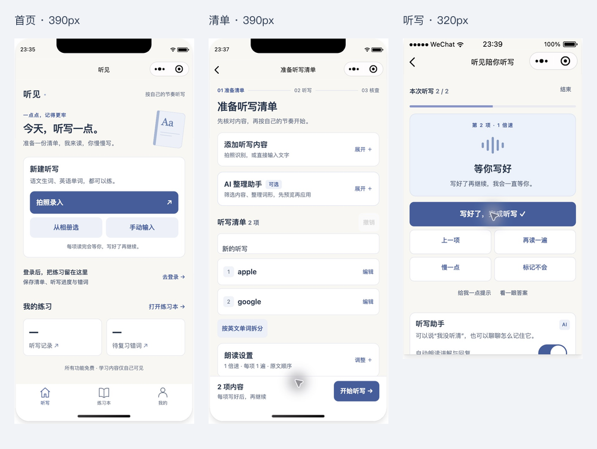

# 小程序前端结构与视觉优化

> 本文记录第一版结构调整。当前视觉已升级为 [2026-10-05 第二版](mini-frontend-v2/README.md)，请以第二版预览与样式约束为准。

日期：2026-10-04（北京时间）。范围：微信原生小程序 `wechat/`，不包含 Web 端重设计或服务端部署。

**本地源码已更新；微信后台已审核通过的是之前上传的 1.0.0。此次界面优化尚未上传或提交审核。** 原交付包 `tingjian-wechat.zip` 保留原版本，查看新界面请在开发者工具打开项目根目录并重新构建。

## 预览没有随还原变化的原因

`project.config.json` 指定 `miniprogramRoot: "miniprogram/"`。开发源文件在 `wechat/`，`npm run mini:build` 才会把模板、样式及编译后的 TypeScript 写入 `miniprogram/`。生成目录被 Git 忽略，源码还原不会自动同步它。

本次检查时两份首页模板确实不同：源码已还原，生成目录仍有上一轮修改。重新构建后，微信开发者工具已显示新版本，无须清除账号或学习数据。

日常开发使用：

```sh
npm run mini:dev
```

命令先构建一次，再监听 `wechat/` 中的 TypeScript、WXML、WXSS 和 JSON；修改或还原时自动重新构建。构建串行执行，并合并短时间内的保存事件。`Ctrl+C` 停止。修改 `.env.local` 或构建脚本后，应重启该命令或手动运行 `npm run mini:build`。手机上已经打开的旧预览包，需要从开发者工具重新生成预览码。

## 六项设计调整

| 维度 | 实现 |
| --- | --- |
| 信息层级 | 首页先显示未完成任务，再显示新建入口与记录；清单页明确准备、听写、核查步骤；核查页同时显示已核查数量与正确率，避免把未核查答案当成绩。 |
| 组件布局 | 文字与照片录入分为两种模式；已有草稿默认收起录入；AI 整理、朗读设置和核查规则按需展开；听写快捷键两列排列；主要操作固定在底部，正文留出空间。 |
| 视觉风格 | 暖白底、白色卡片、墨色正文、单一蓝色主操作。不使用渐变、大片插画、毛玻璃或重阴影。只有分段选中态与输入聚焦使用轻量阴影。 |
| 移动端适配 | rpx、可换行文字、flex 子项 `min-width: 0`、窄屏操作区换行、底部安全区。修正微信 style v2 默认固定按钮宽度与自动居中边距；修正原生输入框的垂直内边距。 |
| 组件状态 | 统一按压 `hover-class`；原生输入 focus/blur 状态及蓝色边框；区分加载、空数据、失败重试；OCR、AI 整理、试听、开始、保存和语音转写分别显示忙碌反馈；明确禁用态；新建及开始动作覆盖等待确认阶段的重复点击保护。 |
| 项目适配 | 保留逐项“写好了”确认、AI 草稿预览后应用、核查后才进入错词本、免费额度说明、隐私授权和数据同步。首页错词入口直接打开错词标签。 |

## 统一样式约束

- 主色 `#455e9b`，正文 `#27354b`，辅助文字 `#657187`，页面底色 `#f8f7f3`。
- 卡片圆角 24rpx，按钮 20rpx，输入框 16rpx；避免每页使用不同圆角与阴影。
- 首页一级标题 46rpx；正文 28rpx；辅助文字 24–26rpx。主要按钮保留足够高度；320px 窄屏进一步增加按钮高度。
- 成功使用绿色，待核查使用琥珀色，确认错误使用红色，并始终显示文字状态，不只靠颜色区分。
- 手机按压反馈通过微信原生 `hover-class` 实现；输入聚焦使用共享 `behaviors/form.ts`。有键盘时补充 `:focus-visible` 样式，不能把桌面 hover 当作手机唯一交互提示。
- 动效仅用于朗读波形与加载；支持 `prefers-reduced-motion`。

## 验证

- `npm run mini:typecheck`、`npm run typecheck` 通过。
- `npm test`：**107 / 107 通过**。新增回归覆盖：新建清单的确认/取消/失败与重复点击；开始听写取消后保留原会话；编辑答案后清除确认与聚焦状态恢复。
- `npm run mini:release` 通过，生成 51 个文件、约 610.2 KiB；合法域名与隐私检查保持启用。
- 自动构建已实际运行，连续保存后重新生成成功；模板和样式与生成目录逐文件一致。
- 开发者工具 **Stable 2.02.2608080 / 基础库 3.17.3** 原生预览通过。检查的视口为 iPhone 5（320×568）、iPhone 12/13（390×844）、iPhone 14 Pro Max（430×932）。
- 390px：未登录首页、登录页、登录后账号页、已有两项草稿及折叠布局。
- 320px：首页、听写暂停/准备声音/等待确认、历史列表、67% 的已有核查概览与逐项核查区。主操作与内容无横向溢出，底部操作可见。
- 430px：首页、文字录入、长英文与中文换行、朗读设置滚动、底部安全区。临时输入未加入清单并已清空。
- 本轮读取了原有 `apple / google` 两项草稿、三项核查历史和一个错词；只重读当前听写项，未推进题号或覆盖记录。

错误与取消逻辑由自动化测试和模板状态检查覆盖；没有为了界面测试主动中断线上服务。真人手机键盘、VoiceOver、相机、录音、iOS/Android 硬件与系统字体放大仍需真机验收；模拟器检查不等于这些已通过。

## 预览

以下为微信开发者工具原生截图，非设计稿。



[首页 390px](mini-frontend/home-390.png) · [清单 390px](mini-frontend/editor-390.png) · [账号 390px](mini-frontend/profile-390.png) · [听写 320px](mini-frontend/practice-320.png) · [历史 320px](mini-frontend/library-320.png) · [核查 320px](mini-frontend/result-320.png)

## 版本与后续发布

本次修改保留在当前工作区，可从 Git 改动中审阅。原界面源码另外保存在本机 `.local/frontend-before/source-20261004.tgz`。小程序隐私检查及合法域名检查保持启用。

备案仍按此前的提交流程等待审核。本地新界面完成真机验收后，应以新版本上传并重新提交代码审核，不能把旧版已通过的审核结果直接用于本次源码。
