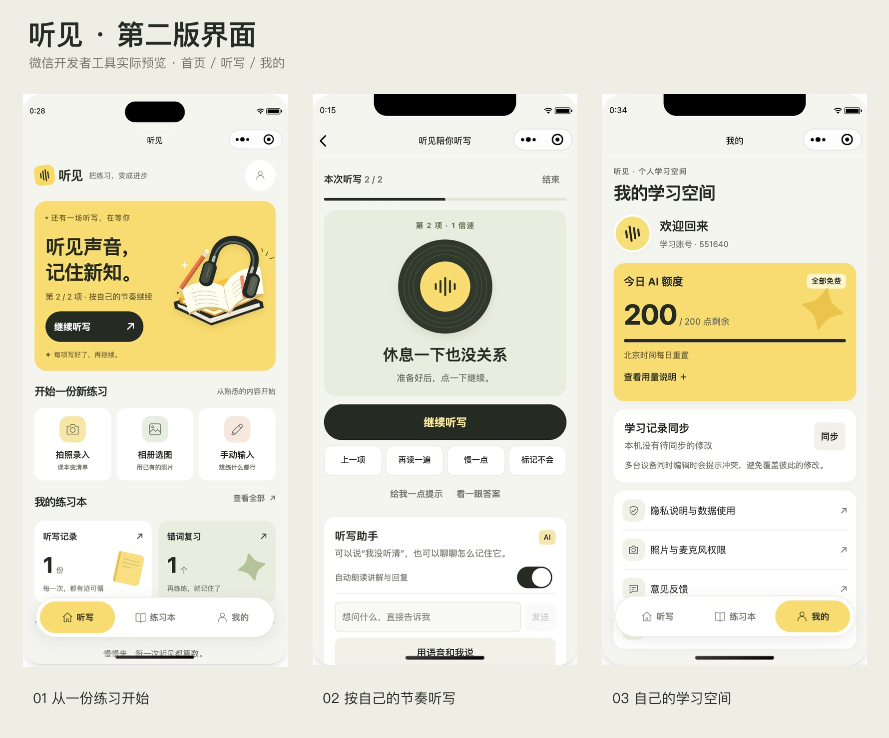

# 听见 · 第二版视觉设计

2026-10-05，微信原生小程序。本版接续第一版的信息结构优化，强化品牌和页面视觉表现。只更新本地源码及开发者工具预览，尚未上传、提交审核或发布。

## 设计落地

| 维度 | 当前实现 |
| --- | --- |
| 信息层级 | 首页优先继续未完成听写，其次继续草稿，再提供新建入口。大标题与图形突出核心动作；真实的历史和错词计数放在两张不同底色的卡片中。 |
| 组件布局 | 黄色插画主卡、三列录入入口、书封式历史列表、唱片式听写播放器、浮动胶囊导航。清单、AI 整理和核查规则继续按需展开。 |
| 视觉约束 | 纸白 `#f5f5ef`、奶油黄 `#f8dc70`、墨黑 `#252b25`、鼠尾草绿 `#e9eddf`。不使用渐变；阴影仅用于导航和图形的轻微立体感。图形来自项目内原创 SVG 与 CSS。 |
| 移动端 | 按 rpx 缩放，320px 窄屏调整字号和按钮排列；底部安全区与浮动导航分别预留空间，错词复习操作栏位于导航上方。 |
| 状态反馈 | 保留按压、原生输入聚焦、加载、禁用、错误重试及各任务独立的忙碌提示；播放时声波运动，暂停时静止；状态始终有文字，不只依赖颜色。 |
| 项目适配 | 每项写好后才推进、核查后才收录错词、免费额度、隐私授权和同步规则均保留。预览使用原有草稿、历史与会话，没有写入演示数据。 |

## 验证记录

- `npm test`：107 / 107 通过。
- `npm run typecheck`、`npm run mini:typecheck`、`git diff --check` 通过。
- `npm run mini:release`：63 个文件，约 686.5 KiB，低于 2 MiB。
- 30 份生成模板、样式与配置和源码逐文件一致，静态图片引用齐全；隐私检查和合法域名检查保持启用。
- 开发者工具实际检查：390px 首页、听写暂停页、核查页、历史列表、账号页；320px 首页、滚动后的底部内容、错词复习操作栏及已有清单；430px 首页。导航切换、高亮和首页错词快捷入口正常。
- 320px 首页能滚动到草稿入口和底部说明，错词复习按钮未被浮动导航遮挡；清单底部主按钮可见。没有为截图推进听写或修改学习内容。
- 本版未重新验证真机键盘、系统字体放大、读屏、相机和录音；模拟器截图不等于这些硬件场景已通过。

## 预览与开发

截图来自微信开发者工具。`home-320.png`、`wrong-320.png`、`editor-320.png`、`home-430.png` 记录不同宽度的布局。

源文件位于 `wechat/`；开发者工具实际读取 `miniprogram/`。`npm run mini:dev` 先构建再监听 TS、WXML、WXSS、JSON、SVG 的修改与还原，避免只还原源码却继续看到旧的生成目录。修改构建脚本或环境变量后需重启监听。手机旧预览需重新生成预览码。

插画源文件：`wechat/assets/study-still-life.svg`；构建时转为本地 PNG。未使用网络外链素材或额外图标字体。第一版截图保留在 `docs/mini-frontend/`，第二版截图位于本目录。
