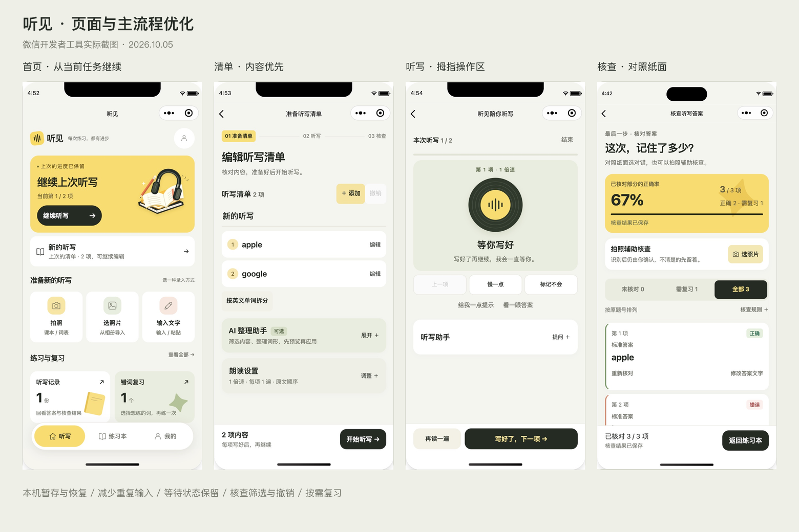

# 听见小程序：主流程与界面体验排查

日期：2026-10-05。范围：`wechat/` 原生小程序的首页、清单编辑、听写、核查、练习本和账号页。本轮同时修正操作逻辑与页面结构，保持奶油黄、纸白、墨色和浅绿的现有视觉方向。

本地构建已经更新到微信开发者工具实际读取的 `miniprogram/`。没有部署、上传、提审或发布。备案和线上服务不属于本轮修改范围。

后续修正：听写页已移除 AI 讲解与聊天，改为持续录音、停顿后自动识别的语音控制。最新行为、147 项测试结果、真机验证边界及听写页截图见 [语音控制修正](voice-control.md)。下方总览中的听写助手截图属于修正前版本。

2026-10-05 核查页布局更新：将独立的大卡片合并为一张连续答案清单，统一显示题号、标准答案与核查状态。已核对项的改判与文字编辑收进“调整”；未核对项保留三种快捷判断。作答改用多行输入，顶部统计与照片入口压缩。通过现有 151 项测试、两套类型检查及生成文件一致性检查；微信模拟器检查 390 / 320 像素下的清单、展开编辑和底部操作栏，未修改原有核查数据。新版实际截图：[390 像素全页](layout-result-390.png)、[展开调整](layout-result-edit-390.png)、[320 像素清单](layout-result-320.png)、[320 像素编辑](layout-result-edit-320.png)。下方总览及旧核查截图保留为此前版本记录。

## 现在的主要操作路径

1. 首页先呈现“继续上次听写”，分别提供旧清单和本机新清单的恢复入口。
2. 拍照、选照片和文字录入都进入独立的新清单。取消选择照片不会清空旧清单；未点“加入清单”的文字也会暂存。
3. 编辑页先看实际题目，再展开 AI 整理和朗读设置。直接点“加入并开始”会合并尚未添加的文字；遇到待核查项会打开并定位该项。
4. 只有开始新听写或明确保存为当前清单时，才确认替换旧清单/旧进度。错词复习也遵守这条路径。
5. 听写页底部保留“再读一遍”和“写好了”。读完后切后台、回来或重新进入，仍然等待用户确认，不要求重新播放。
6. 核查时直接对照纸面标记“写对了 / 写错了 / 漏写”；拍照识别和修改文字作为可选辅助。可先核对一部分、保存、稍后继续。
7. 错词本勾选本次要练的词，再生成复习清单。“已记住”移出后可撤销最近一次操作。

## 确认的问题与修复

| 优先级 | 原问题 / 触发情形 | 本轮处理 |
| --- | --- | --- |
| 高 | 首页新建时先清空旧草稿，取消照片选择也无法取回 | 新清单改为账号隔离的本机工作区；不提前写入正式 draft |
| 高 | 输入还没点“加入清单”，退出就丢失 | 300 ms 暂存原始输入；离开页面时立即补存；首页提供恢复入口 |
| 高 | 点开始时忽略输入框里的内容 | 开始前合并输入；超过 300 项时保留输入并说明原因 |
| 高 | 待核查项让开始按钮一直禁用，用户不知道下一步 | 按钮改为“去核对 N 项”，展开并定位第一项问题内容 |
| 高 | 新听写/错词复习容易覆盖正在编辑或听写的数据 | 复习先暂存；开始前集中说明替换影响并确认，取消保留两边内容 |
| 高 | 切后台会把 waiting 改为 paused，回来必须重听 | 只将播放中/准备中等不可持续状态暂停；waiting 保留 |
| 高 | 点结束后取消，也会丢失“已读完等确认”的状态 | 取消结束恢复进入对话框前的可继续状态 |
| 高 | 保存部分核查时，未核对的历史错词被一并删除 | 只更新本次已经确认的题目，未核对项原有错词保留 |
| 高 | 历史同步成功但错词同步失败，界面可能声称已经保存 | 保存状态同时检查历史与错词；失败保留重试，阻止误报完成 |
| 高 | 筛选后的第 1 行并非原第 1 题，后续操作容易错位 | 视图保留原题号，所有修改和核对按原索引处理 |
| 中 | 纸面核查被迫再输入一遍答案 | 增加直接标记对错/漏写，输入只在需要时展开 |
| 中 | 标记后条目从未核对列表消失，误触难恢复 | 底部操作区提供最近一次核对的撤销；保存成功后结束撤销周期 |
| 中 | “需复习”筛选下编辑文字使条目立即消失 | 正在编辑的条目暂留列表，收起后再按筛选条件处理 |
| 中 | 改文字比较规则也会改掉纸面人工判断 | 保留明确的纸面判断，文字比对结果重新等待确认 |
| 中 | 照片重新识别可重复打开确认或在离开后继续 | 确认前锁定任务并创建取消作用域，离开即取消，取消不显示失败 |
| 中 | 历史第一次保存失败，重试发现本机已有记录就跳过同步 | 重试会同步本机历史，再进入核查页；打开结果失败可再次重试 |
| 中 | 核查无筛选，长列表难找到没处理完的题 | 未核对 / 需复习 / 全部；筛选固定在列表上方，切换后定位答案区 |
| 中 | 错词复习只能一次练全部 | 勾选、全选/取消全选、已选数量和零选择提示 |
| 中 | “已记住”逐词弹确认打断操作 | 直接移出并提供撤销；即使同步失败，本机撤销仍可用 |
| 中 | 各 Tab 刷新时先清空数据，出现闪烁与错误空态 | 同账号保留现有内容刷新；账号变化才清空；丢弃过期请求的响应 |
| 中 | 登录完成后丢失原来要做的事 | 保留清单/听写/核查目的地，登录后继续原操作 |
| 中 | 账号页重复请求配置并可能被旧响应覆盖 | 已登录使用 bootstrap 一次取回数据；以请求序号保护更新 |
| 中 | 普通单词修改朗读文字后，标准答案仍是旧词 | 原朗读与答案相同时联动更新；不同的提示与答案保持独立 |
| 中 | AI 面板挡在清单前，核心操作被装饰和可选功能分散 | 清单优先，AI/设置默认折叠；听写助手默认折叠，主操作固定底部 |
| 低 | 常态就显示“处理冲突”，容易误导用户载入旧版本 | 仅在实际版本冲突时显示处理入口；区分历史与错词冲突 |
| 低 | 删除历史、退出/注销的重复点击容易产生重复确认 | 确认前加操作锁；删除历史入口收进“更多” |
| 中 | 首次额度加载失败却显示 0 / 0，像是额度耗尽 | 用“暂未获取”区分未知与用完；已有额度在刷新失败时保留 |
| 低 | 新建空页面有重复空清单、无效拆分操作 | 空清单阶段突出录入；实际内容加入后再显示列表与管理操作 |

## 视觉与组件约束

- 黄色承载当前任务/结果概览；浅绿色承载听写状态和复习；白色承载可编辑内容。未增加大面积渐变。
- 保留书本、耳机和唱片的识别性，压缩首屏装饰尺寸，留出真实内容和操作空间。
- 一个区域一个主要动作；文字描述说明动作结果，例如“加入并开始”“复习所选”“保存进度”。
- 核查同时使用题号、文字状态、语义色和边线，不只靠颜色区分对错。
- 原生按钮保留点击反馈、禁用和 loading；输入有 focus 边框；错误按加载、识别、保存分别显示，保留对应重试入口。
- 固定操作区为安全区预留空间；页面尾部保留足够 padding，错词操作区位于浮动导航之上。
- 小屏幕提高辅助文字大小；常用按钮采用至少 44 px 的基础触控高度，紧凑布局另作适配。
- 对照原文、生成内容确认、隐私说明和账户隔离继续保留。

## 验证证据

### 自动化

最终运行结果：**127 / 127 通过**。原基线 107 项，本轮增加 20 项回归，并更新两项与新流程对应的旧断言。

主要新增覆盖在 `tests/mini-client.test.ts`，使用实际原生 TypeScript 页面与工具模块，在模拟 wx API 的运行环境中执行：

- 新建导航锁定、取消照片/取消开始、旧 draft/session 保护。
- 本机输入账号隔离、退出清除、本机表单不误上传成云端文档。
- 自动合并文字、300 项限制、提示与答案联动、定位问题项。
- Tab 保留可见数据、旧账号/旧请求响应不覆盖当前 UI。
- 等待状态离开保留、取消结束恢复、迟到的音频回调被忽略。
- 筛选后的原题号、纸面核查和撤销、正在编辑条目保留。
- 部分保存不误删错词、部分网络失败不误报完成。
- OCR 确认锁定、离开页面取消、历史保存失败后的重试。
- 仅复习所选、离线移出错词仍能撤销、登录目的地恢复。

同时通过：

- `npm run mini:typecheck`
- `npm run typecheck`
- `npm run mini:release`：65 个文件，约 717.2 KiB，低于主包上限。
- `git diff --check`
- 30 份 WXML/WXSS/JSON 源文件与生成文件逐字节一致；静态图片引用没有缺失。
- `miniprogramRoot` 仍为 `miniprogram/`，`urlCheck` 仍开启。

### 微信开发者工具

使用原生模拟器，查看了 320 × 568、390 × 844、430 × 932 三档屏幕的代表页面。

| 检查 | 实际观察 |
| --- | --- |
| 输入恢复 | 新清单输入一行临时文字后返回；首页出现恢复卡；重新打开仍有原文字；检查后清空临时文字 |
| 已有清单 | 题目优先、AI/设置折叠、添加与开始可见 |
| 听写恢复 | 已有 waiting 会话进入后直接显示“等你写好”和“写好了，下一项” |
| 320 小屏听写 | 主操作在同一底栏，三个辅助动作可见，助手可继续向下查看 |
| 错词选择 | 取消全选显示 0 项并禁用复习；全选恢复已选数量；未移除用户实际错词 |
| 核查筛选 | “需复习”只显示原第 2 项 banana，原题号与识别文字保持正确 |
| 修改面板 | 可展开和收起实际答案输入区，未改写已有答案 |
| 430 大屏 | 首页卡片、核查区和底栏可见，没有横向溢出 |

账号页实际检查期间曾出现网络失败，随后服务域名 HTTPS 探测返回 200；这次失败促成了“未知额度不显示为 0”的修复，并添加了回归测试。

这里的界面验证是微信开发者工具模拟器。真实 iOS/Android 的软键盘、相机授权、物理录音和 TTS 播放，本轮没有重新完整走一遍；因此不把模拟器观察等同于真机测试。涉及修改核查结果、移出错词、断网和替换清单的边界行为主要用隔离的自动化夹具验证，避免改写已有学习记录。

## 开发与回退

请修改 `wechat/`，不要直接修改生成目录 `miniprogram/`。保存源码后运行 `npm run mini:build`；连续调整时运行 `npm run mini:dev`。撤销源码也需要重新生成，否则开发者工具仍可能显示上次产物。

本轮修改前的源码备份位于 `.local/frontend-before/ui-v2-before-ux-20261005.tgz`。当前修改未提交 Git；可从工作区 diff 审阅。

核查撤销针对最近一次操作，并在成功保存后清除；错词移出撤销保留最近一次移出项。更长周期的版本恢复不在本轮实现范围内。
