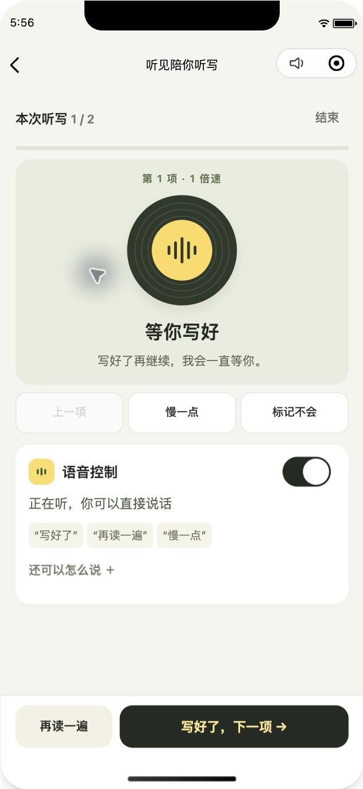
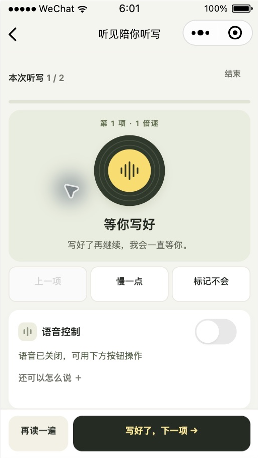
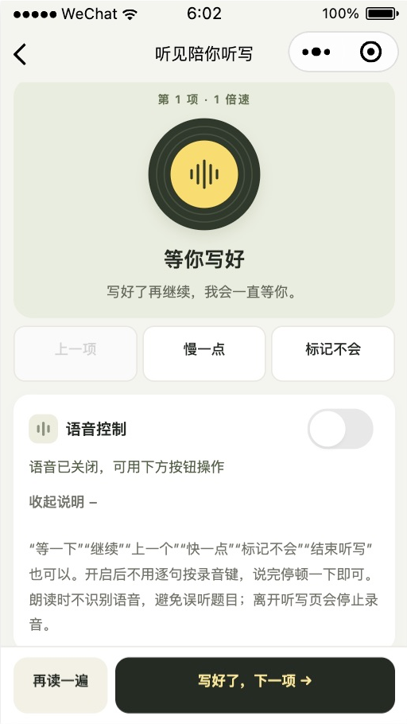

# 听写语音控制修正

2026-10-05，接续本目录的六页 UX 优化。范围为原生小程序 `wechat/`，本地生成目录为 `miniprogram/`。没有上传、部署、提审或发布。

## 手机正则兼容性修复（2026-10-05）

用户手机截图显示录音正常，但语音转写之后出现 `Invalid regular expression`，指向标点清理表达式中的 Unicode 属性转义。此前开发者工具和 Node 测试支持该语法，未反映这部手机的 JavaScript 引擎限制。

已将语音口令和答案比对中两处相关表达式改为共享的 Unicode 标点范围查询，不依赖正则属性转义。保留完整标点处理语义，数学符号、货币符号、文字和表情不会被当作标点误删。新增测试以现代 Unicode 分类作独立参照，并在拒绝属性转义的运行环境中实际执行带标点的 ASR 回调、下一项操作和答案比对。

修复后：151 项测试、两套类型检查与差异检查通过；已重新生成本地小程序包。手机需重新打开最新预览包，已有二维码对应的旧包不会因本地构建自动更新。本次修复尚未在用户手机上复验。

## 产品行为

听写中的语音用于控制老师朗读的节奏。已移除听写页的助手聊天、文字提问、AI 讲解、提示入口和讲解播报；清单页的拍照识别与 AI 整理仍然保留。

进入听写页后，默认开启语音控制，经微信隐私及麦克风授权后持续采集。用户无需逐句点击录音或发送；说完停顿一下后自动识别并执行。关闭开关会立即停止采集和待处理的识别，选择按账号保存在本机，清单页的设置会同步显示该选择。离开听写页、切后台、完成听写时也停止录音；返回页面按已保存的选择恢复。

| 常见表达 | 行为 |
| --- | --- |
| 写好了 / 下一个 | 当前项读完后进入下一项，最后一项进入核查 |
| 再读一遍 / 我没听清楚 | 重读当前项 |
| 慢一点 / 读太快了 | 降低速度并重读当前项 |
| 快一点 | 提高后续朗读速度 |
| 等一下 / 还没有写完 | 保持等待，不跳题、不强制重读 |
| 继续 | 已读完时进入下一项，暂停时恢复朗读 |
| 上一个 | 返回上一项 |
| 标记不会 | 标记当前项，重复说不会取消标记 |
| 结束听写 | 弹出结束确认，仍需确认 |

常见说法由本地规则处理。陌生表达使用既有 `session-agent` 服务理解控制意图，强制关闭提示、不传聊天历史，并仅接收控制指令。模型返回的讲解、聊天及其文字都不会呈现或播放。

## 连续录音及边界

- 使用原生 RecorderManager 的 PCM 帧，16 kHz、单声道、16 位，2 KiB 一帧。语句之间不反复启动录音。
- 活动检测保留约 256 ms 的前置音频，至少 180 ms 有声片段，约 700 ms 停顿后自动结束一句。只提交检测到的短语音，纯静音不会形成请求；短促点击声也会过滤。较长讲话整段舍弃，等待安静后继续，避免截断后的后半句被当作口令。
- 这是轮流说话：自身朗读期间丢弃采集帧，播放结束后再等待 750 ms 消除回声影响。当前不支持朗读中插话打断。识别处理中暂不接收下一条指令，页面明确显示“正在识别”。
- 使用既有云端 ASR，所以仍有断句、网络和服务处理耗时，不能视为零延迟的流式识别。单次识别超过 20 秒即取消，避免很久以前的话突然跳题。
- 原生十分钟录音上限到达后自动续录；其余意外停止、通话中断、权限拒绝和八秒无帧会给出重试提示。收到停止事件后删除微信生成的临时录音文件。
- 指令绑定当前听写、题号和播放轮次。按钮操作、关闭语音或离开页面会取消在途识别，晚到的结果不能控制后续题目。
- 页面仅展示最近一句与执行结果，不积累聊天记录。隐私页面已更新连续录音、短片段提交和关闭方式；本次未重新提交微信平台隐私指引。

## 验证

- `npm test`：147 项通过，其中本轮新增 20 项，并更新旧录音测试。
- `npm run mini:typecheck`、`npm run typecheck`、`git diff --check` 通过。
- `npm run mini:release` 已重新生成本地原生包；开发者工具读取的是 `miniprogram/`，不能只修改或还原 `wechat/` 而不重新构建。
- 测试使用真实小程序 TS 模块和模拟微信 API，覆盖 WAV 数据、静音/短噪声/连续两句话/长语句、原生续录与中断、无帧、否定句、控制意图、拒绝讲解、识别超时、后台与手动操作取消、开关持久化和账号隔离。
- 微信开发者工具实际检查 390 × 844 和 320 × 568。已观察到自动开启后进入“听到你了”的 PCM 帧检测状态，关闭后显示停止；重进及重新编译后仍记住关闭选择。320 像素下主操作固定，展开说明可滚动到完整内容。
- 检查结束恢复 390 像素设备与原先开启的语音偏好，停留首页，不留下麦克风持续运行。未推进真实听写，仍为第 1 / 2 项。

模拟器中的帧事件和状态切换已验证；没有以真实用户语音执行跳题。手机上的实际收音、方言/噪声、耳机、音频播放与录音兼容性、识别延迟和持续十分钟录音仍需要真机验证。微信 API 标注 PC 不支持选择采样率，模拟器不能替代手机端音频精度验证。

## 原生截图

390 像素，语音自动开启后的页面：

320 像素，关闭状态与展开说明：

